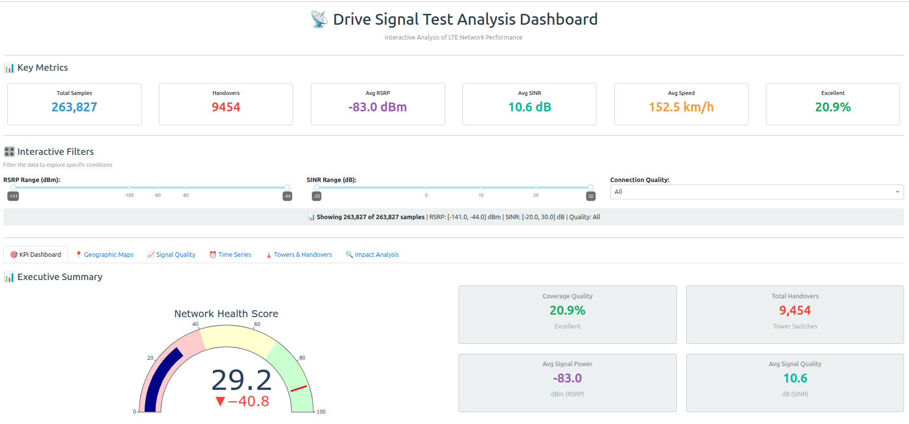

# Highway-4G LTE Signal Analysis

LTE drive-test analysis and visualization using Crawdad data. It focuses on spatiotemporal signal understanding (RSRP, RSRQ, RSSI, SINR), handover-region identification, and clear dashboard-based evaluation of network quality. Focus on data processing, analytics, and interactive visualization for evaluating network performance across time and geography.

## Dashboard

The dashboard analyzes temporal, geospatial, and PCI-based behavior through KPI cards, map views, time-series plots, and handover analysis. Processed outputs are exported to [analysis_output/](analysis_output/) .

Current dataset: **263,827** samples and **9,151** handovers, with quality classes of **20.9% Excellent**, **16.6% Moderate**, and **62.5% Poor**.

### Run

Install dependencies with `pip install -r requirements_dashboard.txt`, run `python dashboard.py`.

### Results Analysis

Dashboard:

Dashboard demo:

<video src="analysis_output/dashboard.mp4" controls width="900"></video>

If the player is not shown, open the file directly: [analysis_output/dashboard.mp4](analysis_output/dashboard.mp4)
